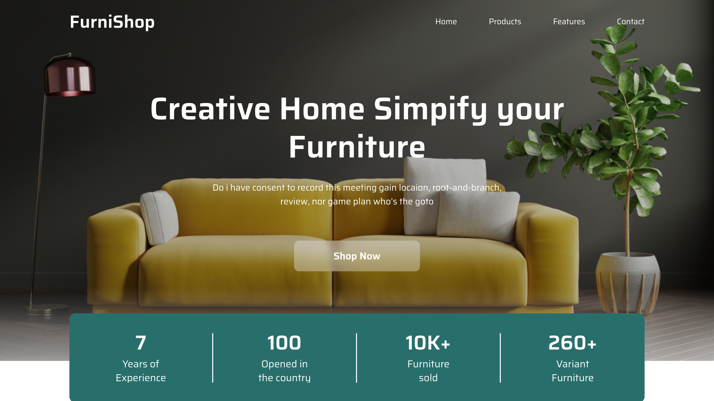

# Projeto Landing Page Furni-Shop



## 💭 Descrição

Essa Landing Page foi desenvolvida como treinamento de criação de interfaces em NextJs e Tailwindcss.

- [Acesse o Figma](https://www.figma.com/design/FyuEA0LYx6qNwi7hXOr8y8/FurniShop?node-id=0-1&t=0Ec9OtInlOqN3VZN-0)

## 🧠 Funcionalidades

 ✔️ **Layout Responsivo:** A página é otimizada para ser visualizada em diferentes dispositivos e tamanhos de tela, garantindo uma experiência de usuário consistente.

 ✔️ **Design Atraente:** O design foi cuidadosamente implementado para corresponder às especificações do Figma, com atenção aos detalhes visuais, tipografia e espaçamento.

## 🖥️ Tecnologias Utilizadas

- [React](https://react.dev) - biblioteca para interfaces de usuário
- [NextJS](https://nextjs.org) - framework react para aplicações web 
- [TypeScript](https://www.typescriptlang.org) - superset, linguagem baseada em javascript
- [Tailwindcss](https://tailwindcss.com) - framework css de classes utilitárias

## 📂 Esquema de pastas
```
./src
├── app
│   └── _components
├── assets
│   └── images
├── components
│   ├── common
│   ├── layout
│   └── ui
├── hooks
└── lib
```

## 📝 Resumo da Estrutura
- **app**: Componentes e páginas específicas da aplicação.
  - **_components**: Componentes internos da aplicação.
- **assets**: Contém as páginas da aplicação.
- **styles**: Recursos estáticos da aplicação.
  - **images**: Imagens utilizadas na aplicação.
- **components**: Componentes reutilizáveis.
  - **common**: Componentes comuns utilizados em várias partes da aplicação.
  - **layout**: Componentes relacionados ao layout da aplicação, como cabeçalhos e rodapés.
  - **ui**: Componentes de interface de usuário, como botões e formulários.
- **hooks**: Hooks personalizados utilizados na aplicação.
- **lib**: Bibliotecas e utilitários compartilhados na aplicação.

## 🛠️ Modificando o projeto

### Siga as seguintes instruções para instalar e poder modificar o projeto em sua máquina

### 📋 Pré-requisitos:

Para baixar, executar e modificar o projeto, você precisa ter instalado em sua máquina: 
* [Node](https://nodejs.org/en)
* Um gerenciador de pacotes, como o [Npm](https://www.npmjs.com)
* [Git](https://git-scm.com/downloads)
* Editor de código ou IDE, como o [VSCode](https://code.visualstudio.com/Download)
  
### 🔧 Instalação e execução

1. Clone o repositório
```bash
git clone git@github.com:aleretamero/furni-shop.git
```

2. Acesse a pasta do projeto
```bash
cd furni-shop
```

3. Instale as dependências
```bash
npm install
```

4. Inicie o servidor de desenvolvimento do projeto
```bash
npm run dev
```

Obs: o servidor iniciará na porta 3000 - acesse por: <http://localhost:3000/>

## Colaboradores 🤝🤝

| Foto                                                       | Nome                                                 |
| ---------------------------------------------------------- | ---------------------------------------------------- |
|  | [Alexandre Retamero](https://github.com/aleretamero) |

## Licença

[MIT](https://choosealicense.com/licenses/mit/)
